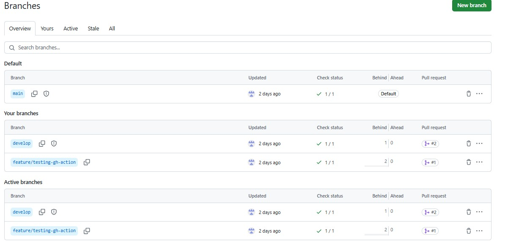
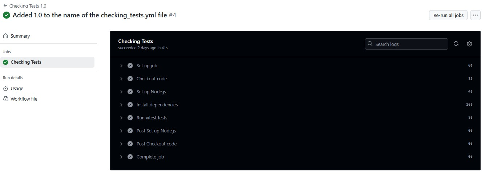
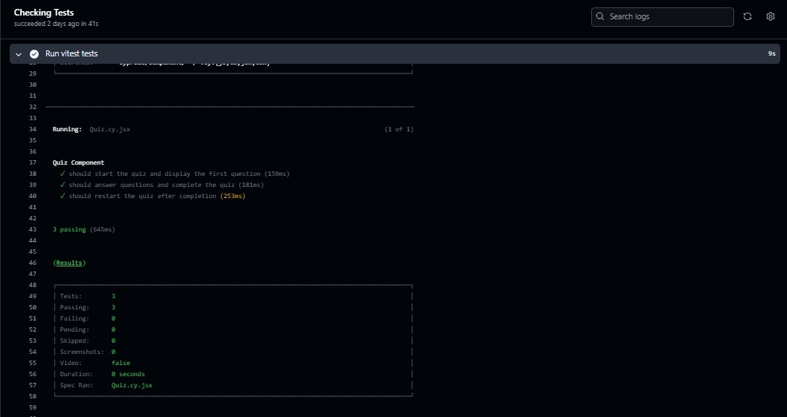
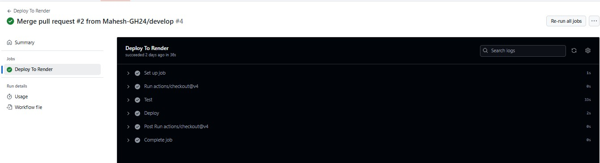
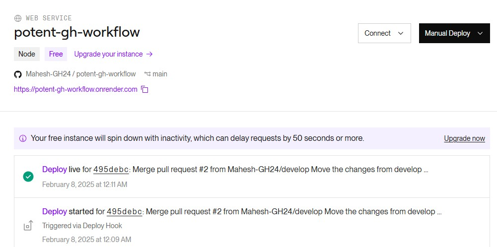

# Potent GitHub 
   

   ## Description

   This application demonstrates CI/CD pipeline using GitHub Actions to run the component tests via Cypress when a pull request is made to the
   develop branch.The application is only deployed via Render after a successful pull request from develop to main branch has been completed. The branches are also protected via branching rules.The application can be accessed at https://potent-gh-workflow.onrender.com/

   ## Table of Contents

   - [Installation](#installation)
   - [Technologies](#Technologies)
   - [Usage](#usage)
   - [Screenshots](#screenshots)
   - [Challenges](#challenges)
   - [Tests](#tests)
   - [Future Implementation](#Future-Implementation)
   - [Contributing](#Contributing)
   - [Questions](#questions)
   - [License](#license)

   ## Installation
   The installation steps are simple - do a npm i, npm run build, npm run seed after successfully downloading the application. The database is hosted in MongoDB Atlas and the environment variables are created in Render along with turning off Auto deploy.

   ## Technologies
   GitHub, GitHub Actions, MongoDB Atlas, Cypress, TypeScript, Javascript,npm

   ## Usage
   Please do a npm i, npm run build, npm run seed after successfully downloading the application.When a change is pushed to develop branch, the cypress component tests are run. After a successful execution of the tests, its ready for us to merge the Pull Request. Now we are ready to move the changes to main branch. So create a pull request from develop to main branch and once successful, merge to main branch which triggers the deployment in render via deploy hook.
   
   ## Screenshots

   **Branches**

   
   
   **Github Action - Develop**

   

   **Github Action - Develop - Cypress Execution**

   

   **Github Action - Main**

   

   **Render deployment - Main**

   

   ## Challenges
   During the project, the configurations related to cypress took some time and was challenging. Overall, the GitHub work flow actions was helpful to understand the overall workflow from pushing a change from feature branch -> develop -> main -> render deployment.   

   ## Tests
   Ensure the workflow is per Github actions and the branch rules aren't bypassed anytime.

   ## Future Implementation
   Add additional cypress tests for develop branch.

   ## Contributing
   Please review the future ideas options and try to contribute or if you find any issues during your testing, please contact me to report issues

   ## Questions
   Please check my GitHub Profile (https://github.com/https://github.com/Mahesh-GH24)  
   Please contact me at MaheshGunasekaran24@gmail.com

   ## License
   Apache License v2.0